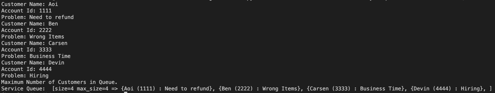

# Queue

### Introduction
Queue is a method to make list which is characterized __First In First Out(FIFO)__. This method is good for making wait lists for long process. 

### Visual and Structure Example to get image

As this image represents, this method is always keep tracking what is the first item and what new item will be added. 
### Process and Performance
Queue method tracks which is the next output and which is the last input by __Front__ and __Back(or Rear)__. And they are keep changing when input or output occur. This input and output process is called  __Enqueue__ and __Dequeue__. When front item is dequeued, second item will be the new front item. As same as this, when new item is enqueued, the item will be the new back instead of previous back item.


As an algorithms, it is working __O(1)__ performances except dequeue under dynamic array situation. Performance of dequeue is __O(n) because they need to 
### Enqueue and Dequeue
#### -Enqueue
Enqueue is a process to input new item at the end of other queue. This new item acts as a back (rear) which can be a sign this item is the last one.


```python
self.queue.append(data)
###queue has dynamic array or fixed array
```

#### -Dequeue

Dequeue is a process to output item from queue. Manly front item will be output, but it can change based on the condition (queue's priority level). Then, the performance will be O(n)
```python
if len(self.queue) <= 0:
      raise IndexError() ###Add condition, if it needs
value = self.queue[0]
del self.queue[0]
return value
```

### _Circular Queue (Advanced)_

### Best Usage
Queue is good for the operation which does not need to or cannot be processed immediately, but have to be processed in FIFO order.


When many people can access simultaneously, queue method works to make the process easier. In many case, they set the __maximum size__ of the queue not to make items or customers waiting for a long time. 

#### Example (Problem)
```python
class Customer_Service:
    """
    Maintain a Customer Service Queue.  Allows new customers to be 
    added and allows customers to be serviced.
    """

    class Customer:
        """
        Defines a Customer record for the service queue.
        This is an inner class.  Its real name is CustomerService.Customer
        """

        def __init__(self, name, account_id, problem):
            """
            Initialize the Customer Record
            """
            self.name = name
            self.account_id = account_id
            self.problem = problem

        def __str__(self):
            """
            Return a string representing the record so we can print it out later
            """
            return self.name + " (" + self.account_id + ") : " + self.problem

    def __init__(self, max_size):
        """
        Initialize the empty queue using a Python List.  The maximum size of the 
        queue is defined by parameter passed in by the user.  If the size is 
        invalid (less than or equal to 0) then the size will default to 10.
        """
        self.queue = []
        if max_size <= 0:
            self.max_size = 10  # Default value if max size is invalid
        else:
            self.max_size = max_size

    def add_new_customer(self):
        """
        Prompt the user for the customer and problem information.  Put the 
        new record into the queue.
        """
        # Verify there is room in the service queue
        #if len(self.queue) > self.max_size:    # Defect 3 - Should use >=
        if len(self.queue) >= self.max_size:
            print("Maximum Number of Customers in Queue.")
            return

        name = input("Customer Name: ")
        account_id = input("Account Id: ")
        problem = input("Problem: ")

        # Create the customer object and add it to the queue
        customer = Customer_Service.Customer(name, account_id, problem)
        self.queue.append(customer)

    def serve_customer(self):
        """
        Dequeue the next customer and display the information.
        """
        # Need to check to make sure there are customers in the queue
        if len(self.queue) == 0:      # Defect 2 - Need to check queue length
            print("No Customers in the Queue")
        else:
            # Need to read and save the customer before it is deleted
            # from the queue
            customer = self.queue[0]
            del self.queue[0]         # Defect 1 - Delete should be done after 
            print(customer)

    def __str__(self):
        """ 
        Suppport the str() function to provide a string representation of the
        customer service queue.  This is useful for debugging.  If you have a 
        Customer_Service object called cs, then you run print(cs) to see the 
        contents.
        """
        result = "[size=" + str(len(self.queue)) + " max_size=" + str(self.max_size) +" => "
        for customer in self.queue:
            result += "{"+str(customer)+"}"  # Uses the __str__ from Customer class
            result += ", "
        result += "]"
        return result


service = Customer_Service(4)
service.add_new_customer()
service.add_new_customer()
service.add_new_customer()
service.add_new_customer()
service.add_new_customer()
print("Service Queue: ", service)
```
#### Output


### Problems and Solution.

#### Problem

Based on the example above, please implement a code with queue method. The conditions are following:
1. The maximum size of queue is four times of number of employees.
2. If the Account id ends with '00', the queue will be put on front.
3. If there are multiple account id that ends with '00', the order for '00' will be normal queue.
(Ex)  (Previous:100, 123, 534, 221) + (Enqueue: 200) = (New order: 100, 200, 123, 534, 221)

Start from this link

#### Solution

[Answer]()


