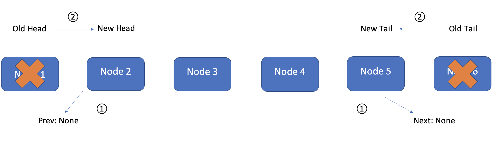

# Linked List

### Introduction
Linked List is a method to store the connection of each element in dynamic array (which is called __Node__) in their memory.
This __Node__ stores the __Data__ and __Next__(and __Prev__) which allow computer to recognize the relationship of each Node. And Linked List is searched by the 1st Node which is called __Head__ and finished by the end of Linked List which is called __Tail__.
Let's look at more specific images.
### Visual and Structure Example to get image
#### - Node
As the visual image below, Node contains different fields.
1. __Data__: which contains the value to be stored
2. __Next__ : which contains a reference to the next node
3. __(Prev)__: which contains a reference to the previous node.

They are set in the class like this:
```python
class Node:
        """
        Each node of the linked list will have data and links to the 
        previous and next node. 
        """

        def __init__(self, data):
            """ 
            Initialize the node to the data provided.  Initially
            the links are unknown so they are set to None.
            """
            self.data = data
            self.next = None
            self.prev = None

```

#### - Head and Tail
As the image below, Linked List has __Head__ and __Tail__. They tells which Node is the starting point and ending point of iteration process.
1. __Head__: which is the first Node of the Linked list, so its Prev is _None_ (If their is not Prev field in Node, setting None is not necessary).
2. __Tail__: which is the last Node of the Linked List, so its Next must be  _None_

```python
def __init__(self):
        """
        Initialize an empty linked list.
        """
        self.head = None
        self.tail = None
```
### Process and Performance
The advantage of this method is that it can easily look up the stored data with order or data condition. when the Linked List is inserted new Node or remove Node from list, it is looked up from Head to Tail, so the performance will be __O(n)__.
However, if the change affect only Head or Tail (like when it will be used as Queue method), the performance will be __O(1)__
### Best Usage
Linked List can save memory more effectively than fixed array. Also this method just indicates the connection of each Nodes, so they can move flexibly. However, if data needs to be looked up, they use liner look up from head to tail, which is not effective enough.


### Insert,  Remove, and Replace
#### - Insert
##### 1. Case Head

After Add new node, indicate,
1. Node 1 is New Node's Next
2. New Node is Node 1's Previous,
3. New Node is the new Head
```python
new_node.next = self.head # 1) Connect new node to the previous head
self.head.prev = new_node # 2) Connect the previous head to the new node
self.head = new_node      # 3) Update the head to point to the new node
```
##### 2. Case Tail

After Add new node, indicate,
1. New Node is Node 4's Next
2. Node 4 is new Node's Previous
3. New Node is the new Tail
```python
new_node.prev = self.tail # 1) Connect new node to the previous tail
self.tail.next = new_node # 2) Connect the previous tail to the new node
self.tail = new_node      # 3) Update the tail to point to the new node
```
##### 3. Case middle 
For inserting new Node in the middle of Linked List:
1. Search Node before the target place
2. New Node is Node 2's Next
3. Node 3 is New Node's Next
4. Node 2 is New Node's Previous
5. New Node is Node 3's Previous

```python
curr = self.head
        while curr is not None:
            if curr.data == value:
                # If the location of 'value' is at the end of the list,
                # then we can call insert_tail to add 'new_value'
                if curr == self.tail:
                    self.insert_tail(new_value)
                # For any other location of 'value', need to create a 
                # new node and reconenct the links to insert.
                else:
                    new_node = LinkedList.Node(new_value)
                    new_node.prev = curr       # Connect new node to the node containing 'value'
                    new_node.next = curr.next  # Connect new node to the node after 'value'
                    curr.next.prev = new_node  # Connect node after 'value' to the new node
                    curr.next = new_node       # Connect the node containing 'value' to the new node
                return # We can exit the function after we insert
            curr = curr.next # Go to the next node to search for 'value'node
```
#### - Remove
For removing a Node, the Prev and Next relationship should be dropped like following them,
##### 1. Case Head
For removing Head,
1. Disconnect the second node from the first node
2. Update the head to point to the second node

```python
self.head.next.prev = None  # 1) Disconnect the second node from the first node
self.head = self.head.next  # 2) Update the head to point to the second node
```
##### 2. Case Tail
For removing Tail,
1. Disconnect the second last node from the last node
2. Update the tail to point to the second last node

```python
self.tail.prev.next = None # 1) Disconnect the second last node from the last node
self.tail = self.tail.prev # 2) Update the tail to point to the second last node
```
##### 3. Case middle 
For removing Middle,
1. Search target Node to remove
2. Connect target previous Node and Target next Node
a. Node 2's Next is Node 4
b. Node 4's Prev is Node 2

```python
curr = self.head
while curr is not None: #1 Search target
    if curr.data == value:
        if curr == self.head:
            self.head = curr.next
            self.head.prev = None
        elif curr == self.tail:
            self.tail = curr.prev
            self.tail.next = None
        else:
            curr.prev.next = curr.next #2) Node 2's Next is Node 4
            curr.next.prev = curr.prev #3) Node 4's Prev is Node 2
        return
        
    curr = curr.next 
```
#### - Replace
For replacing, find the target old data and replace only data in Node

```python
curr = self.head
while curr is not None:
    if curr.data == old_value:
        curr.data = new_value
        
        
    curr = curr.next 
```
### Problems and Solution.

#### Problem

Please fix errors in the _LinkedListPracticeProb File_ with Linked List method:
1. There are errors in _insert tail_, _remove head_, and _remove tail_
2. Fill in pass in _insert head_, _insert after_, _remove_, _replace, and _everyOther_
3. For _everyOther_ function, please display every other data from head.
(Example: if the data => {1,2,3,4,5,6,7}, the output will be {1,3,5,7})
- Start by downloading this link
[LinkedListPracticeProb](Python/LinkedList/Problem.py)

#### Solution

- Do not download up to finishing your work
[Answer](Python/LinkedList/Solution.py)
