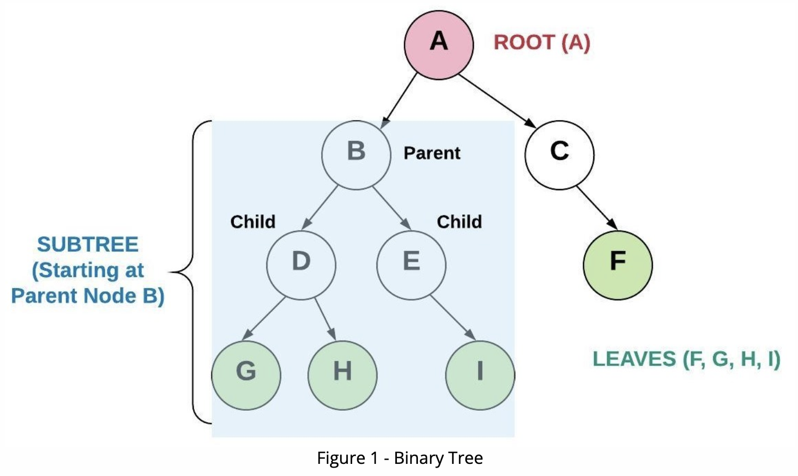
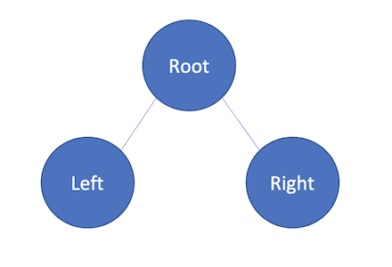
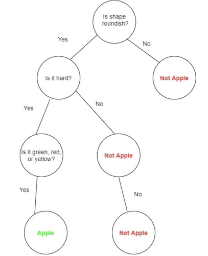
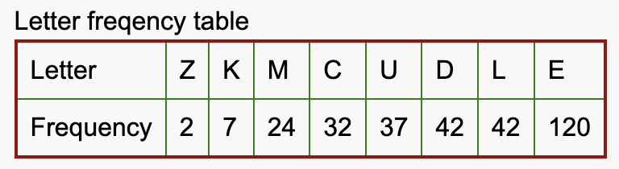
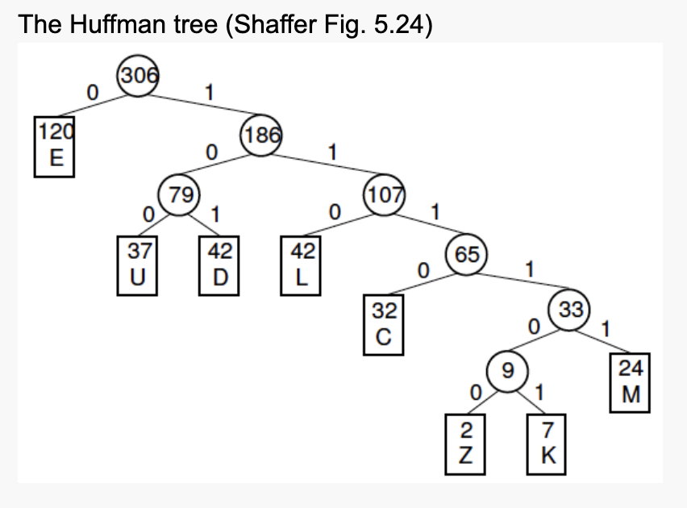
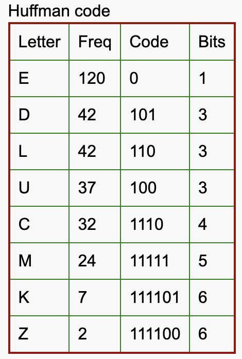

# Tree

### Introduction
Tree is a method to connect node from top to bottom. It is not liner order like Linked List. It starts from  __Root__ which is the top Node and can have other Nodes under itself. The Nodes below the root also can have other Nodes, and the relationship is called __Parent__ and __Child__.

In this material, students will mainly learn __Binary Tree__.
### Visual and Structure Example to get image
#### - Binary Tree
In the Binary Tree method, the number of child Nodes is at most two Nodes (__right__ and __left__). Each child Nodes also can have other Nodes by acting like a parent Node. Then the tree which starts from new parent Nodes which is located under roots is called __subtree__. Also, if the Node is not connecting with any Node, which means the Node is the bottom of tree, is called __leaf__ node.


#### - Binary Search Tree (BST)
Binary Search Tree is a type of binary tree which is organized based on a rule that the number which is bigger than parent Node keep moving to right, and the number which is smaller than parent Node keep moving to left up to being leaf Node.
Then the number of Node from Root to bottom leaf is called __Height__ of the tree (Root is height: 0, and the children from Root is height: 1).

### Process and Performance
The advantage of Binary Search Tree is that it automatically organizes the data with minimum height as short as possible. Also the performance of Binary Search Tree is depends of the height of the tree => __O(height)__ . So, this method can organize data automatically and most efficiently. 

The height can be calculated by:
__h ≥ ⌈log₂(n+1) - 1⌉ ≥ ⌊log₂(n)⌋__

And the maximum number of Node can be calculated by:
__n ≤ 2⁽ʰ⁺¹⁾ − 1__

It means Binary Search Tree can insert and remove with __O(log n)__ performance.

### Recursion
The best practice to use Tree method is __recursion__. Binary tree method traverses the nodes to look up data unlikely Queue, Stack, and Linked List. 

Since a Node has left or/and right nodes as children, this structure can recognized that there are These units of structure up to leaves (which doesn't have any child Nodes.) So, By checking both right and left data, and right's rights and left data and left's right and left data simultaneously.... up to leave Nodes (which right and left data are None), This tree method shows the traversal data quickly.

Look at code example:
```python
 def _get_height(self, node):
        if node is None: ## if the recursion reach to leave Nodes,
            return 0     ## return 0
        LH = self._get_height(node.left)  ## call its own function to keep looking up left Nodes
        RH = self._get_height(node.right) ## call its own function to keep looking up right Nodes
        hight = 1 + max(LH, RH) ## get result from recursion
        return hight
```
### Best Usage
As it says in performance, Binary Tree has a really good efficient way to handle data. So, it can be used for decision trees, Machine Learning, and sorting. In this material, it says root Node has right and left. It means it can be used as 0 or 1, yes or no, and o or x. 


There are only two options at most, so computer can handle the data quickly even though the amount of data increase exponentially.

### Add  (Binary Search Tree)
For adding new data, if the new data is bigger than existing data, move to right side and check again. If not, move to left side and check again. Repeat this processes up to the new data will be leaf Node of the tree.
```python
if data != node.data:
  if data < node.data:
      # The data belongs on the left side.
      if node.left is None:
          # We found an empty spot
          node.left = BST.Node(data)
      else:
          # Need to keep looking.  Call _insert
          # recursively on the left sub-tree.
          self._insert(data, node.left)
  else:
      # The data belongs on the right side.
      if node.right is None:
          # We found an empty spot
          node.right = BST.Node(data)
      else:
          # Need to keep looking.  Call _insert
          # recursively on the right sub-tree.
          self._insert(data, node.right)
```
#### Remove
### Contain
For checking if the tree contains specific value, recur function checking each data to right and left side up to leaves Nodes. 
```python
def _contains(self, data, node):
  
  if data < node.data: ## Check left side
      if node.left is None:
          return False ## reach to leaves Nodes but couldn't find the data
      else:
          return self._contains(data, node.left) ## recur to next children Nodes
  elif data > node.data: ## Check right side
      if node.right is None:
          return False ## reach to leaves Nodes but couldn't find the data
      else:
          return self._contains(data, node.right) ## recur to next children Nodes
  elif data == node.data:
      return True ## when find data, return True

```


### _Advanced Huffman Tree_
__HuffmanTree__ is one type of binary tree which is mainly used to compress data into short (unlike ASCII). This makes it possible to make data structure with lower encoding. 
The process of Huffman Tree is that:
1. count each letter frequency

2. Build binary tree from leave Nodes. Then start from lowest letter, in example, z(2) and k(7) is the lowest Nodes. Add up these two Nodes, then memory will be 9 (2 + 7). Next lowest two Nodes are (9: which comes from z+k) and M(24). So the sum Node will be 33 (9 + 24). Repeating this process like image below.
After building up Huffman Tree, assign left Node 0, and right Node 1.

3. Based on the Huffman Tree above, each letter can be encode like this:


Based on this rule created by Huffman Tree. letter can encode and decode like this:
DEED => 10100101 (8 bits)
MUCK => 111111001110111101 (18 bits)

Like the encoding example right above, Movie, video, article, or other stuff can be encoded shorter than without encoding rule.
### Problems and Solution
Please fix errors in the _TreePracticeProb File_ with Linked List method:
1. There are some errors in  _contains_, please fix it
2. There are pass  in _insert_ and _get_hight_, please fix it
3. __Challenge__: Fix some error for Huffman Tree Functions
Start from this link
[TreePracticeProb](Python/Tree/Problem.py)

#### Solution

[Answer](Python/Tree/Solution.py)